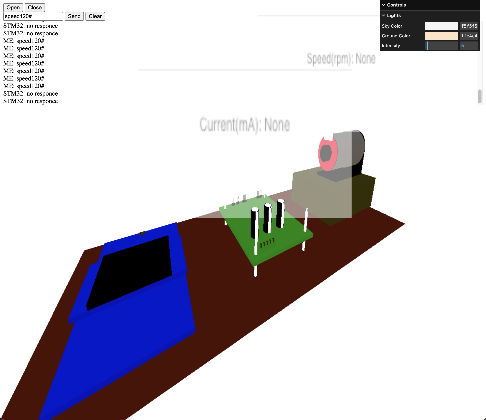

# Motor Twin
Digital twin of a motor control system.

The user interface of the final exp of Course Embbed Systems.

## Tech Stack
- Golang
    - website backend
    - serial communication
    - Websocket
- Digital Twin
    - threejs
    - blender

